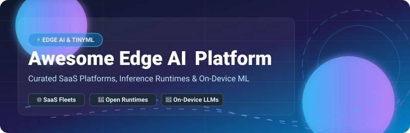

<p align="center">
  
</p>

<p align="center">
  <a href="https://github.com/ishandutta2007/Awesome-Awesome-Awesome"></a>
  <a href="https://discord.gg/jc4xtF58Ve"></a>
  <a href="https://github.com/ishandutta2007/Awesome-Edge-AI-Platform/stargazers"></a>
  <a href="https://github.com/ishandutta2007/Awesome-Edge-AI-Platform/network/members"></a>
  <a href="https://github.com/ishandutta2007/Awesome-Edge-AI-Platform/blob/main/LICENSE"></a>
  <a href="https://github.com/ishandutta2007"></a>
</p>

---

# ⚡ Awesome Edge AI Platform Ecosystem

> A curated catalog of enterprise SaaS platforms, open-source inference engines, edge orchestration frameworks, and TinyML toolkits for on-device machine learning and localized AI deployment.

**Last updated: September 2026**

---

## 📌 Table of Contents

- [🌐 SaaS / Hosted Edge AI Platforms](#-saas--hosted-edge-ai-platforms)
- [🔓 Open-Source GitHub Projects](#-open-source-github-projects)
- [🛠️ Edge Hardware & Specialized Runtimes](#-edge-hardware--specialized-runtimes)
- [💡 Recommended Architecture Blueprints](#-recommended-architecture-blueprints)
- [🤝 How to Contribute](#-how-to-contribute)
- [💖 Support & Community](#-support--community)
- [⚠️ Disclaimer](#%EF%B8%8F-disclaimer)
- [📈 Star History](#-star-history)

---

## 🌐 SaaS / Hosted Edge AI Platforms

> 💡 **Market Size & Dynamics**: The global Edge AI market is estimated at **$18.5 Billion in 2026** (projected to reach **$45+ Billion by 2030** at ~26% CAGR). The sector is currently **highly fragmented**, characterized by specialized competition across edge silicon, runtime acceleration, and fleet orchestration, preventing any single platform from establishing a "winner-take-all" monopoly.

The following enterprise SaaS platforms provide centralized management, over-the-air (OTA) model deployment, remote monitoring, and edge security across distributed hardware fleets:

| SaaS Platform | Description | Starting Price (USD) | Free Tier / Trial Limit | Company Size (Valuation / Revenue) |
| :--- | :--- | :--- | :--- | :--- |
| 🟢 **[NVIDIA Fleet Command](https://www.nvidia.com/)** | Enterprise edge AI management platform for deploying & managing AI applications across distributed NVIDIA Jetson and GPU edge clusters. | **$350 / node / year** ($29.17/mo) | **90-Day Free Trial** (Includes NVIDIA LaunchPad access for up to 10 nodes) | **$3.0+ Trillion** (Market Cap) |
| 💻 **[Lenovo Open Cloud Automation](https://www.lenovo.com/)** | Edge-to-cloud infrastructure deployment & orchestration automation for large-scale distributed edge deployments. | **$45 / node / month** | **30-Day Enterprise POC Trial** (Up to 5 edge server instances) | **$57.0+ Billion** ($60B Rev) |
| ⚡ **[ClearBlade](https://clearblade.com/)** | Enterprise IoT & edge computing platform offering edge orchestration, autonomous edge execution, and AI inference. | **$50 / edge gateway / month** | **Free Forever Developer Plan** (10k msgs/mo & 2 edge nodes) | **$500M+ Valuation** ($50M Rev) |
| 🛡️ **[ZEDEDA](https://zededa.com/)** | Edge virtualization and orchestration platform delivering zero-trust security and lifecycle management for edge nodes. | **$10 / edge node / month** | **30-Day Free Trial** (Full ZedControl suite for up to 5 edge nodes) | **$400M+ Valuation** ($72M+ Raised) |
| 🎯 **[Edge Impulse](https://edgeimpulse.com/)** | Category-leading AutoML development platform for embedded ML and time-series sensor processing on microcontrollers. | **$39 / developer / month** | **Free Forever Community Edition** (100 jobs/mo, 20min limit, 5GB storage) | **$250M+ Valuation** ($50M+ Raised) |
| 🐳 **[Balena](https://www.balena.io/)** | Container-based IoT fleet management platform (balenaOS) with OTA container updates, remote SSH, and VPN monitoring. | **$99 / month** (Starter fleet up to 20 devices) | **Free Forever for up to 10 devices** (Full balenaCloud feature access) | **$150M+ Valuation** |
| 🏭 **[FogHorn](https://foghorn.io/)** *(Johnson Controls)* | Industrial IoT edge AI platform delivering real-time streaming analytics and ML inference for smart manufacturing. | **$15 / stream engine / month** | **30-Day Evaluation Trial** (Includes 1 industrial edge gateway license) | **$100M+ Acquisition Value** |
| 🚀 **[Avassa](https://avassa.io/)** | Container application orchestration platform designed specifically for edge hosts, retail devices, and on-premises sites. | **$15 / edge host / month** | **Free Forever for up to 10 edge hosts** (Full app management features) | **$50M+ Valuation** |
| 🔌 **[Adlink Edge](https://www.adlinktech.com/)** | Edge hardware & software integration suite providing smart software stack for industrial AI computer systems. | **$25 / device / month** | **30-Day Developer Trial** (Evaluation package for hardware & software) | **$40M+ Division Rev** |

---

## 🔓 Open-Source GitHub Projects

Below is a curated list of top open-source projects for self-hosting edge orchestration, on-device LLM inference, and lightweight embedded machine learning, **sorted strictly descending by GitHub star count**:

| Open-Source Project | GitHub Stars | Category | Description |
| :--- | :--- | :--- | :--- |
| 🦙 **[Ollama](https://github.com/ollama/ollama)** | [](https://github.com/ollama/ollama/stargazers) | On-Device LLM Runtime | Get up and running with Llama 3, Mistral, Gemma, and other open LLMs locally on macOS, Linux, and Windows. |
| ⚡ **[llama.cpp](https://github.com/ggml-org/llama.cpp)** | [](https://github.com/ggml-org/llama.cpp/stargazers) | Edge LLM Engine | Pure C/C++ inference engine for LLMs with quantization (GGUF), AVX2/NEON vectorization, and minimal memory footprint. |
| 🚀 **[vLLM](https://github.com/vllm-project/vllm)** | [](https://github.com/vllm-project/vllm/stargazers) | High-Throughput Serving | High-throughput and memory-efficient LLM serving engine powered by PagedAttention for edge servers. |
| 📦 **[K3s](https://github.com/k3s-io/k3s)** | [](https://github.com/k3s-io/k3s/stargazers) | Lightweight Kubernetes | Lightweight CNCF-certified Kubernetes distribution packaged as a single binary, optimized for edge/ARM devices. |
| 🎯 **[MediaPipe](https://github.com/google-ai-edge/mediapipe)** | [](https://github.com/google-ai-edge/mediapipe/stargazers) | Vision & Audio Pipeline | Google's cross-platform framework for building customizable live and streaming perceptual on-device ML pipelines. |
| 🤖 **[LocalAI](https://github.com/mudler/LocalAI)** | [](https://github.com/mudler/LocalAI/stargazers) | Local AI REST API | Self-hosted, OpenAI-compatible REST API for local inferencing with LLMs, audio generation, and image generation. |
| 🏎️ **[ncnn](https://github.com/Tencent/ncnn)** | [](https://github.com/Tencent/ncnn/stargazers) | Mobile & Edge NN | Tencent's high-performance neural network inference framework optimized for mobile and cross-platform edge execution. |
| 🧠 **[MLC LLM](https://github.com/mlc-ai/mlc-llm)** | [](https://github.com/mlc-ai/mlc-llm/stargazers) | Universal LLM Runtime | Universal high-performance LLM deployment engine bringing large models natively to hardware backends and web. |
| 🔷 **[ONNX Runtime](https://github.com/microsoft/onnxruntime)** | [](https://github.com/microsoft/onnxruntime/stargazers) | Cross-Platform Runtime | Microsoft's high-performance inference engine for ONNX models across mobile, embedded CPUs, GPUs, and NPUs. |
| ⚡ **[MNN](https://github.com/alibaba/MNN)** | [](https://github.com/alibaba/MNN/stargazers) | Mobile Inference Engine | Alibaba's lightweight deep learning inference engine optimized for on-device computer vision and local LLMs. |
| 1️⃣ **[BitNet](https://github.com/microsoft/BitNet)** | [](https://github.com/microsoft/BitNet/stargazers) | 1-bit LLM Framework | Microsoft's official inference engine for 1-bit quantized LLMs (bitnet.cpp), delivering extreme energy savings on edge CPU. |
| ⚙️ **[OpenVINO](https://github.com/openvinotoolkit/openvino)** | [](https://github.com/openvinotoolkit/openvino/stargazers) | Intel Edge Optimizer | Intel's open-source toolkit for optimizing deep learning models for high-speed inference across Intel hardware. |
| ☸️ **[KubeEdge](https://github.com/kubeedge/kubeedge)** | [](https://github.com/kubeedge/kubeedge/stargazers) | CNCF Edge Kubernetes | CNCF graduated Kubernetes-native edge computing framework extending container orchestration to edge nodes with offline autonomy. |
| 📱 **[ExecuTorch](https://github.com/pytorch/executorch)** | [](https://github.com/pytorch/executorch/stargazers) | PyTorch On-Device | PyTorch's official end-to-end solution for running PyTorch models on edge devices and mobile platforms. |
| 🔬 **[TensorFlow Lite Micro](https://github.com/tensorflow/tflite-micro)** | [](https://github.com/tensorflow/tflite-micro/stargazers) | MCU TinyML Runtime | Standard framework for running ML models on microcontrollers and embedded devices with kilobytes of memory. |
| 🔄 **[Baetyl](https://github.com/baetyl/baetyl)** | [](https://github.com/baetyl/baetyl/stargazers) | LF Edge Framework | LF Edge framework extending cloud computing, data, and ML services seamlessly to IoT edge hardware. |
| 🧩 **[uTensor](https://github.com/uTensor/uTensor)** | [](https://github.com/uTensor/uTensor/stargazers) | TinyML C++ Engine | Extremely lightweight C++ AI inference engine generating optimized code for Cortex-M microcontrollers. |
| 🔌 **[Akri](https://github.com/project-akri/akri)** | [](https://github.com/project-akri/akri/stargazers) | K8s Resource Interface | A Kubernetes Resource Interface for the Edge, discovering IP cameras, USB sensors, and local hardware. |
| 🛡️ **[EVE-OS](https://github.com/lf-edge/eve)** | [](https://github.com/lf-edge/eve/stargazers) | Edge Virtualization OS | LF Edge open-source virtualization engine providing a secure operating system foundation for edge nodes. |
| 🌌 **[Open Horizon](https://github.com/open-horizon/anax)** | [](https://github.com/open-horizon/anax/stargazers) | Autonomous Orchestration | LF Edge management platform for containerized workload lifecycle & AI model deployment to distributed devices. |
| 📊 **[Piccolo AI (SensiML)](https://github.com/sensiml/piccolo)** | [](https://github.com/sensiml/piccolo/stargazers) | AutoML for Sensor ML | AGPLv3 open-source AutoML tool suite for developing time-series sensor classification models on MCUs. |
| ⚡ **[Zant](https://github.com/ZantFoundation/Z-Ant)** | [](https://github.com/ZantFoundation/Z-Ant/stargazers) | Zig Embedded ML | Open-source Zig SDK for deploying quantized neural networks on microcontrollers like Raspberry Pi Pico. |
| 🧠 **[EdgeBrain](https://github.com/rudra496/EdgeBrain)** | [](https://github.com/rudra496/EdgeBrain/stargazers) | Local Edge Inference | Sub-100ms lightweight edge AI engine with FastAPI backend, MQTT messaging, and Docker deployment. |

---

## 🛠️ Edge Hardware & Specialized Runtimes

- 📟 **[ESP32 AI](https://github.com/espressif/esp-dl)** — Runs quantized offline language models and deep neural networks directly on ESP32-S3 microcontrollers.
- 🍏 **[Hailo Apps](https://github.com/hailo-ai/hailo-rpi5-examples)** — Runnable vision, VLM, LLM, and speech pipeline applications for Hailo-8L accelerators on Raspberry Pi 5.
- 🔬 **[PicoLM](https://github.com/mit-han-lab/tinyml)** — Executes quantized billion-parameter GGUF models through a zero-dependency C engine on low-power RISC-V targets.

---

## 💡 Recommended Architecture Blueprints

```
                     ┌──────────────────────────────────────────────────┐
                     │          Cloud Control Plane & Analytics         │
                     │  (NVIDIA Fleet Command / Balena / ClearBlade)   │
                     └────────────────────────┬─────────────────────────┘
                                              │ (OTA Model Sync & Fleet Monitoring)
                                              ▼
┌─────────────────────────────────────────────────────────────────────────────────────────────┐
│                                     Edge Site / Local Gateway                               │
│                                                                                             │
│   ┌──────────────────────────────┐        ┌─────────────────────────────────────────────┐   │
│   │   Edge Orchestration Layer   │        │          Edge AI Inference Runtime          │   │
│   │   (KubeEdge / K3s / Baetyl)  │ ◄────► │  (llama.cpp / ONNX Runtime / ExecuTorch)    │   │
│   └──────────────┬───────────────┘        └──────────────────────┬──────────────────────┘   │
│                  │                                               │                          │
│                  ▼                                               ▼                          │
│   ┌──────────────────────────────┐        ┌─────────────────────────────────────────────┐   │
│   │   Hardware Access Interface  │        │          Embedded MCU Sensor Layer          │   │
│   │       (Akri / EVE-OS)        │        │   (TFLite Micro / Piccolo / uTensor)        │   │
│   └──────────────────────────────┘        └─────────────────────────────────────────────┘   │
└─────────────────────────────────────────────────────────────────────────────────────────────┘
```

---

## 🤝 How to Contribute

Contributions are welcome! Please follow these guidelines:
1. 🍴 **Fork** this repository.
2. 📝 Add or update entries in `README.md` maintaining the existing Markdown structure and criteria.
3. 🔗 Ensure all links lead directly to official product pages or open-source GitHub repositories.
4. 📬 Submit a **Pull Request** with a brief summary of the proposed additions.

---

## 💖 Support & Community

Thank you for exploring the **Awesome Edge AI Platform** ecosystem! 🚀

If you find this repository valuable for your edge deployment, IoT infrastructure, or on-device machine learning projects:
- ⭐ **Star this repository** to help others discover it!
- 🔀 **Fork & Contribute** to expand the ecosystem.
- 📢 **Share with your network** across LinkedIn, X/Twitter, and Discord.

If you'd like to support ongoing updates, maintenance, and open-source contributions, consider buying me a coffee or sponsoring the project:

<p align="center">
  <a href="https://github.com/sponsors/ishandutta2007">
    
  </a>
</p>

---

## ⚠️ Disclaimer

- This list is **community-curated** for informational purposes and does not represent explicit endorsement.
- Edge AI deployments involve distributed infrastructure; ensure rigorous device hardening, encrypted container transport, and security patching.
- Self-hosted open-source runtimes require appropriate OTA updating mechanisms and device monitoring infrastructure.

---

## 📈 Star History

[](https://star-history.dera.page/#ishandutta2007/Awesome-Edge-AI-Platform&type=date&legend=top-left)
